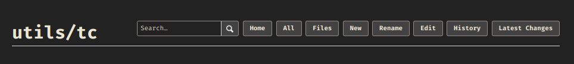
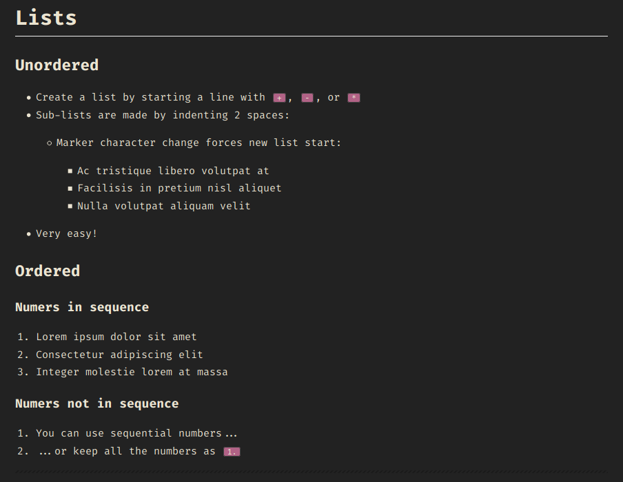
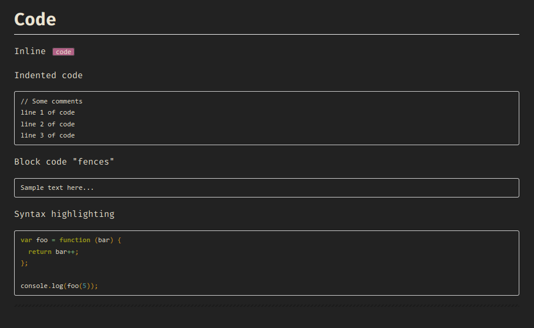
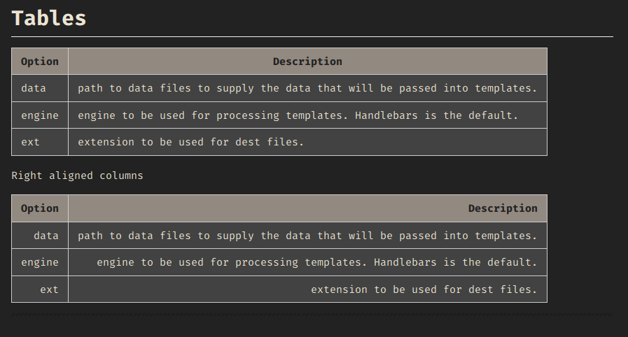
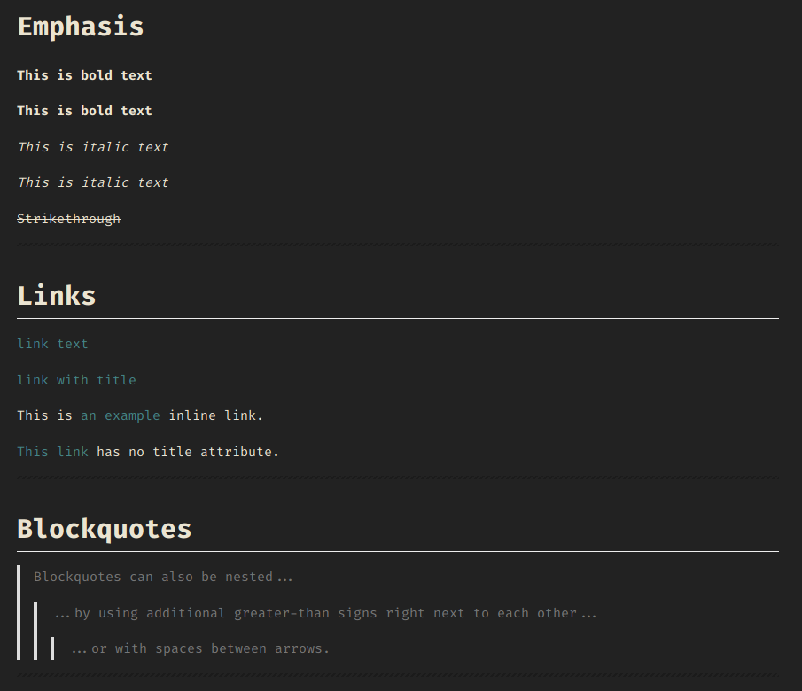

# Gollum dark theme

## Screenshots







## Usage

### Gollum

Create file `custom.css` in wiki root and start gollum with option `-css`

### Nginx

Add in Nginx vhost config sub_filter

```conf
server {
    listen          80;
    ...

    location / {
        ...
        '</head>'
        '<link rel="stylesheet" type="text/css" href="https://telepuz.github.io/gollum-dark/custom.css" media="all">
        </head>';
        sub_filter_once on;
        ...
    }
}
```